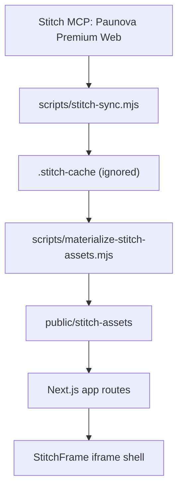

# Architecture

## Current State

The project is a Next.js App Router application with Stitch HTML mounted as the visual layer.

## Current Route Mapping

- `/` -> `public/stitch-assets/pages/home.html`
- `/tratamientos` -> `public/stitch-assets/pages/tratamientos.html`
- `/limpieza-facial-profunda-hydrash` -> `public/stitch-assets/pages/limpieza-facial-profunda-hydrash.html`
- `/quienes-somos` -> `public/stitch-assets/pages/quienes-somos.html`
- `/contacto` -> `public/stitch-assets/pages/contacto.html`
- `/international-patients` -> `public/stitch-assets/pages/international-patients.html`
- `/blog` -> `public/stitch-assets/pages/blog.html`

## Planned Layers

- `src/app`: routes and route handlers.
- `src/components/stitch`: Stitch mounting and future extracted visual components.
- `src/components/doctor`: future private app components.
- `src/lib`: server-only integrations and shared utilities.
- `src/data`: static content registries.
- `src/types`: domain types.
- `styles`: future design/system notes or extracted CSS.
- `public/stitch-assets`: materialized visual assets from Stitch.
- `public/images/paunova`: future approved local brand assets.

## Future Backend Boundaries

- Google Sheets access must live under `src/lib/sheets` or API routes only.
- WhatsApp webhook must live under `src/app/api/whatsapp/webhook`.
- OpenAI calls must live under server-only modules or route handlers.
- Clinical records must not be mixed with marketing tables or content modules.

